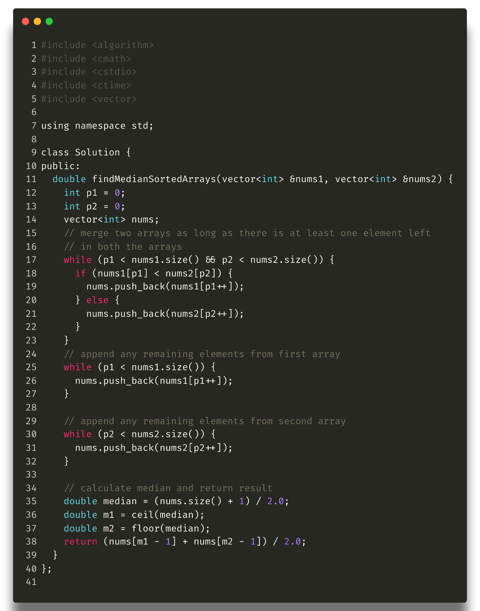
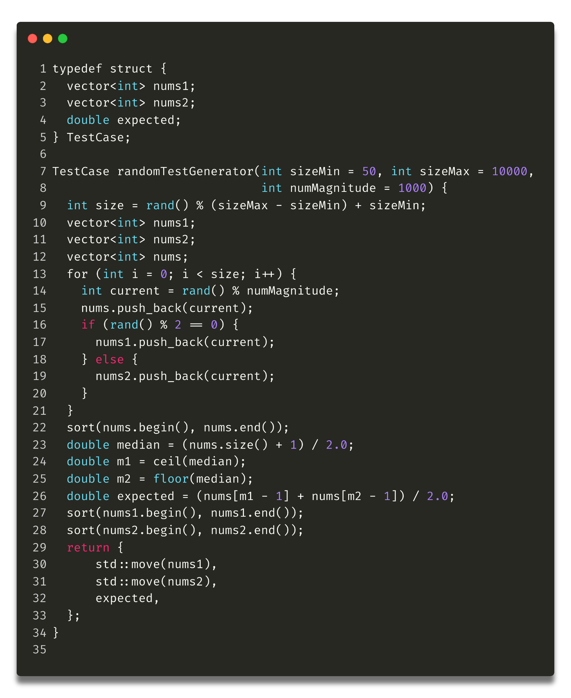
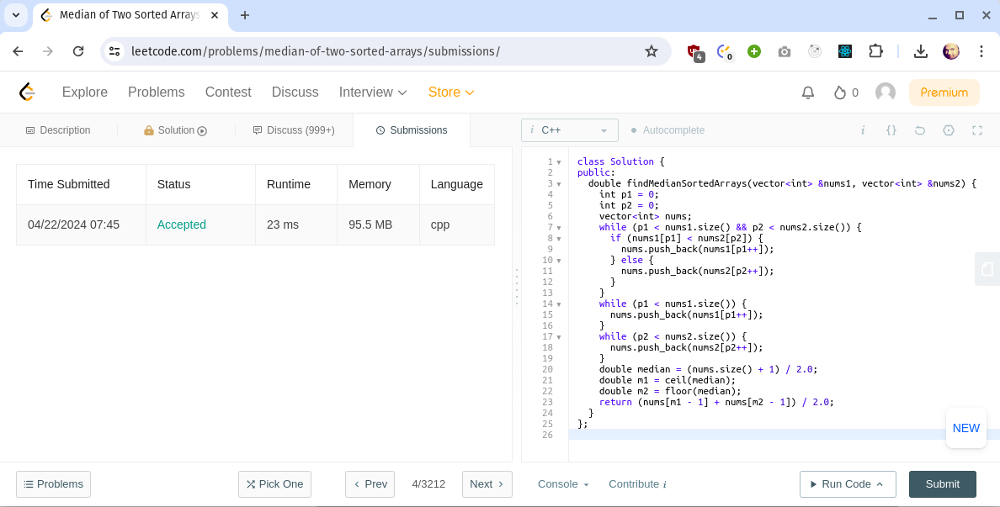

# **Problem-Solving Documentation - Median of Two Sorted Arrays**

###  **Problem Statement:** 
> **URL: [[https://leetcode.com/problems/median-of-two-sorted-arrays/]](https://leetcode.com/problems/median-of-two-sorted-arrays/)**

Given two sorted arrays nums1 and nums2 of size m and n respectively,
return the median of the two sorted arrays.

Constraints:

-   nums1.length == m

-   nums2.length == n

-   0 \<= m \<= 1000

-   0 \<= n \<= 1000

-   1 \<= m + n \<= 2000

-   -106 \<= nums1\[i\], nums2\[i\] \<= 106

### **Approach:**

As per the problem description, the problem has two sorted arrays which
means we can merge those two arrays into a single merged array in O(n)
time using only O(min(m,n)) comparisons. Once we have the merged array
in the natural sorted order calculating the median is trivial.

**Initial Insights:**

-   The median is the middle value if the total number of elements is odd, or the average of the two middle values if the total number of elements is even.

#### **Data Structures and Algorithms Considered:** 
A simple two-pointer method can be used to merge two sorted arrays until one of them is completely exhausted. The second array can be appended to the end as they fall later in the natural order.

###  **Code Implementation:**



### **Testing:**

#### **Sample Test Cases:**

-   **Test Case 1:**

    -   Input: nums1 = \[1, 3\], nums2 = \[2\]

    -   Expected Output: 2.0

-   **Test Case 2:**

    -   Input: nums1 = \[1, 2\], nums2 = \[3, 4\]

    -   Expected Output: 2.5

-   **Test Case 3:**

    -   Input: nums1 = \[0, 0\], nums2 = \[0, 0\]

    -   Expected Output: 0.0

#### **Edge Cases:**

-   One of the arrays is empty: nums1 = \[\], nums2 = \[1\] (expectedoutput: 1)

-   Arrays of different lengths: nums1 = \[1, 3, 8, 9, 15\], nums2 =\[7, 11, 19, 21, 18, 25\] (expected output: 11)

### **Fuzz testing:**

We can generate a random set of input and expected values to perform the
fuzz/stress test of the solution.



###  **Complexity Analysis:**

-   **Time Complexity:** O(n+m) linear time. since each element is only being walked only once.

-   **Space Complexity:** O(n+m) since we store the arrays in another list.

### **Discussion and Optimization:**

#### **Challenges:**

-   Ensuring functionality when one of the arrays is empty.

-   Ensuring functionality when arrays have different lengths

#### **Optimizations:**

-   We can further optimize the solution by only merging the required length to calculate the median.

-   We can use the binary search algorithm to further optimize the time complexity of the solution
### **Compilation**
 ```bash
  g++ -o md median_of_two_array.cpp
  ```

### **Conclusion** 
*Using this solution we could solve this leet code hard problem and get to the accepted status.*

